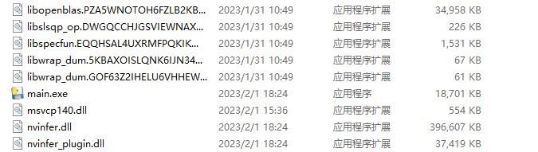
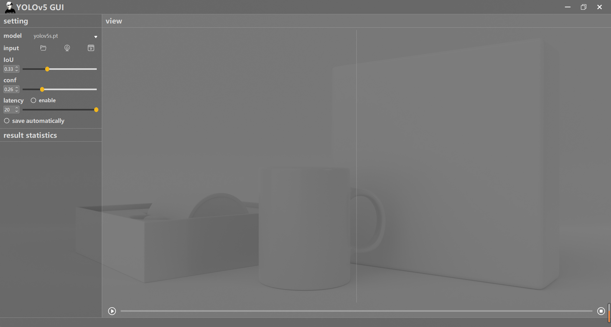
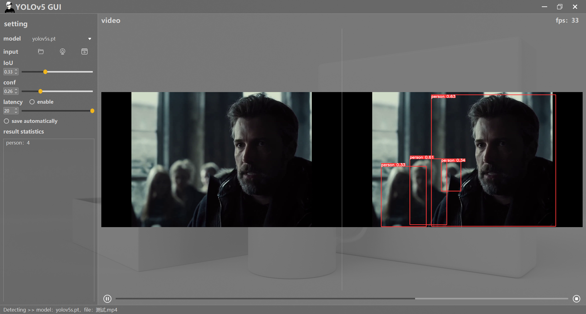
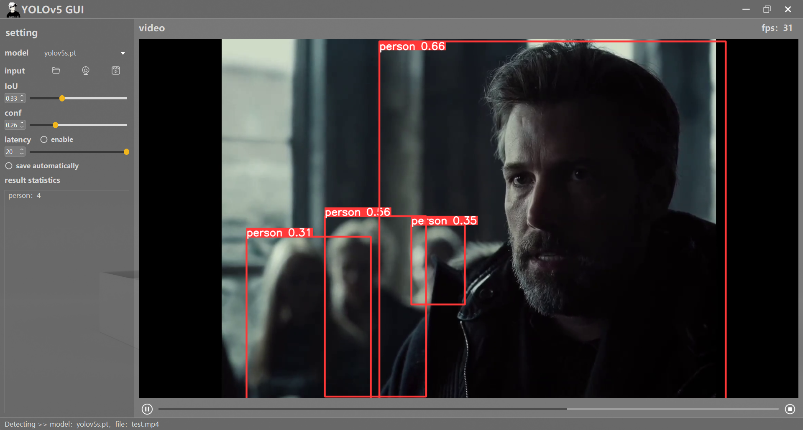

### TIPS

This repo is based on [YOLOv5 v6.1](https://github.com/ultralytics/yolov5/tree/v6.1)

Download the models of  YOLOv5 v6.1 from [here](https://github.com/ultralytics/yolov5/releases/tag/v6.1)，and put the them to the pt folder. When the GUI runs, the existing models will be automatically detected.

Other versions: [v5.0](https://github.com/Javacr/PyQt5-YOLOv5/tree/yolov5_v5.0), ...

If you don't interested in code, you can use the packaged GUI. Download link: [Google Drive](https://drive.google.com/file/d/1UpU0zqDsH_fgkiHw7wLakFMygULXM6qc/view?usp=sharing) or [Baidu Netdisk-pwd=6666](https://pan.baidu.com/s/105Hl2UqRSaDbh4hJQWQ8rg?pwd=6666 ).

Download the zip file and unzip it to the destination, find and run main.exe



### Updated Date：2023/2/1






### Demo Video：
[https://www.bilibili.com/video/BV1sQ4y1C7Vk?spm_id_from=333.999.0.0](https://www.bilibili.com/video/BV1sQ4y1C7Vk?spm_id_from=333.999.0.0)

### Quick Start

```bash
conda create -n yolov5_pyqt5 python=3.8
conda activate yolov5_pyqt5
pip install -r requirements.txt
python main.py
```
### About Packaging

- install pyinstaller

```
pip install pyinstaller==5.7.0
```

- package the GUI

```
pyinstaller -D -w --add-data="./utils/*;./utils" --add-data="./config/*;./config" --add-data="./icon/*;./icon" --add-data="./pt/*;./pt" --add-data="./imgs/*;./imgs" main.py
```

- if no errors occur, the packaged application is in dist/main

### Function

1. support image/video/webcam/rtsp as input
2. change model
3. change IoU
4. change confidence
5. set latency
6. paly/pause/stop
7. result statistics
8. save  detected image/video automatically

You can find ui files in [main_win](./main_win) and [dialog](dialog)


