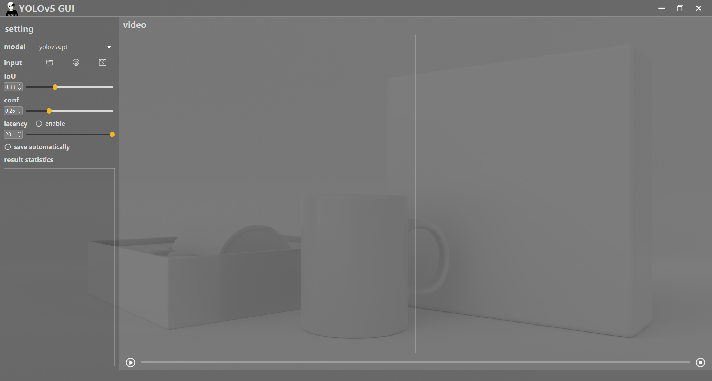

### TIPS

This repo is based on [YOLOv5 v6.1](https://github.com/ultralytics/yolov5/tree/v6.1)

Download the models of  YOLOv5 v6.1 from [here](https://github.com/ultralytics/yolov5/releases/tag/v6.1)，and put the them to the pt folder. When the GUI runs, the existing models will be automatically detected.

Other versions: [v5.0](https://github.com/Javacr/PyQt5-YOLOv5/tree/yolov5_v5.0), ...

### Updated Date：2022/11/29



### Demo Video：
[https://www.bilibili.com/video/BV1sQ4y1C7Vk?spm_id_from=333.999.0.0](https://www.bilibili.com/video/BV1sQ4y1C7Vk?spm_id_from=333.999.0.0)

### Quick Start

```bash
conda create -n yolov5_pyqt5 python=3.8
conda activate yolov5_pyqt5
pip install -r requirements.txt
python main.py
```
You can find ui files in [main_win](./main_win) and [./dialog](dialog)


